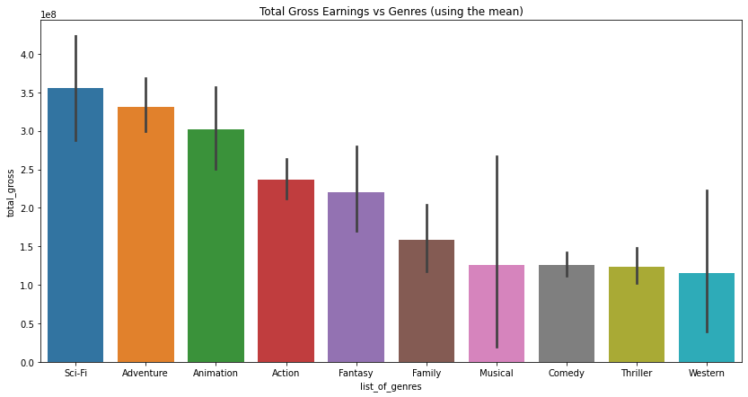
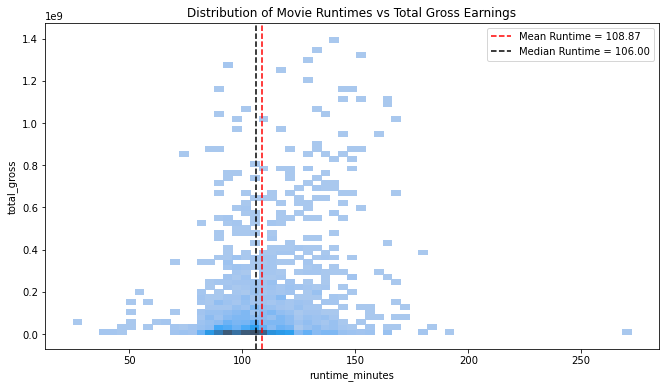
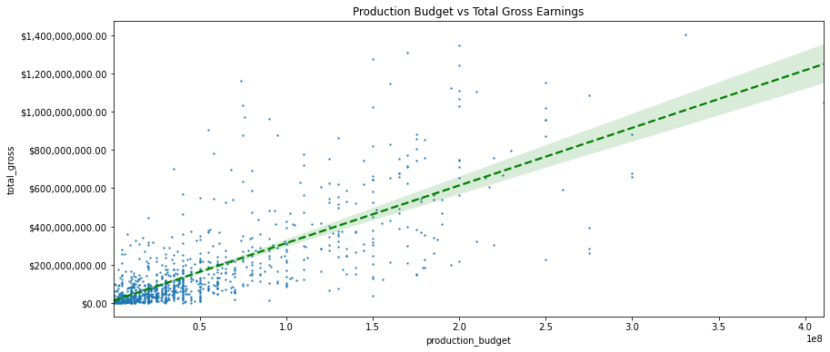

# Microsoft Movie Analysis

**Author**: Gustavo Villagrana

## Overview

This project analyzes movie data that will help Microsoft's new movie studio identify various film attributes in order to maximize potential earnings and success. 

### Business Problem

Microsoft sees all the big companies creating original video content and they want to get in on the fun. They have decided to create a new movie studio, but they don’t know anything about creating movies. Exploring what types of films are currently doing the best at the box office will produce actionable insights that the head of Microsoft's new movie studio can use to help decide what type of films to create.

### The Data

In the folder `data` are movie datasets from:

* [Box Office Mojo](https://www.boxofficemojo.com/)
* [IMDB](https://www.imdb.com/)
* [Rotten Tomatoes](https://www.rottentomatoes.com/)
* [TheMovieDB](https://www.themoviedb.org/)
* [The Numbers](https://www.the-numbers.com/)

The primary data sources for this project are:

* imdb.title.basics
* imdb.title.ratings
* bom.movie_gross
* tn.movie_budgets.csv.gz

### Project Findings and Presentation

#### Finding # 1 -- Which Genres Are Most Profitable?



Recommendation: Based on our results, Microsoft should create Sci-Fi films in order maximize probablity of sucess and profitability. It is also possible to create films with multiple genres (such as Sci-Fi, Adventure, and Action) and still be very profitable.

#### Finding # 2 -- Do Runtime Minutes Influence Gross Earnings?



Recommendation: Set the runtime between 100 minutes to 150 minutes in order to maximize the probability of success and profitability. Films with runtimes less than 80 rminutes or more than 165 minutes were not very profitable. 

#### Finding # 3 -- Does Production Budget Affect Gross Earnings?



Recommendation: Our results indicate that there is a POSITIVE relationship between production budgets and total gross earnings. In short, higher production budgets render higher total gross earnings. 

See the full analysis in the [Jupyter Notebook](./microsoft-movie-analysis.ipynb) or review this [presentation](./Microsoft-Movie-Analysis-Presentation-Final.pdf).

## Repository Structure

```
├── data
├── images
├── README.md
├── Microsoft-Movie-Analysis-Presentation-Final.pdf
└── microsoft-movie-analysis.ipynb
```